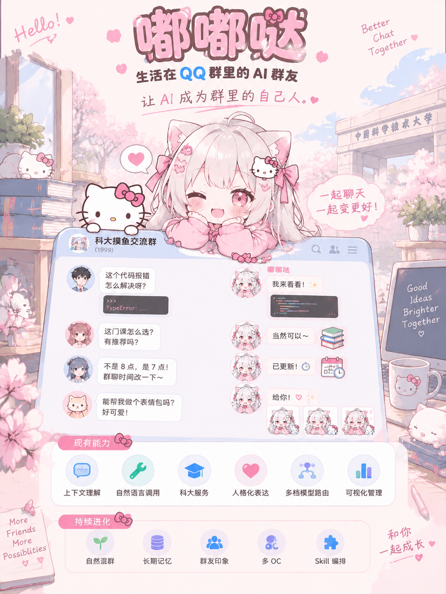
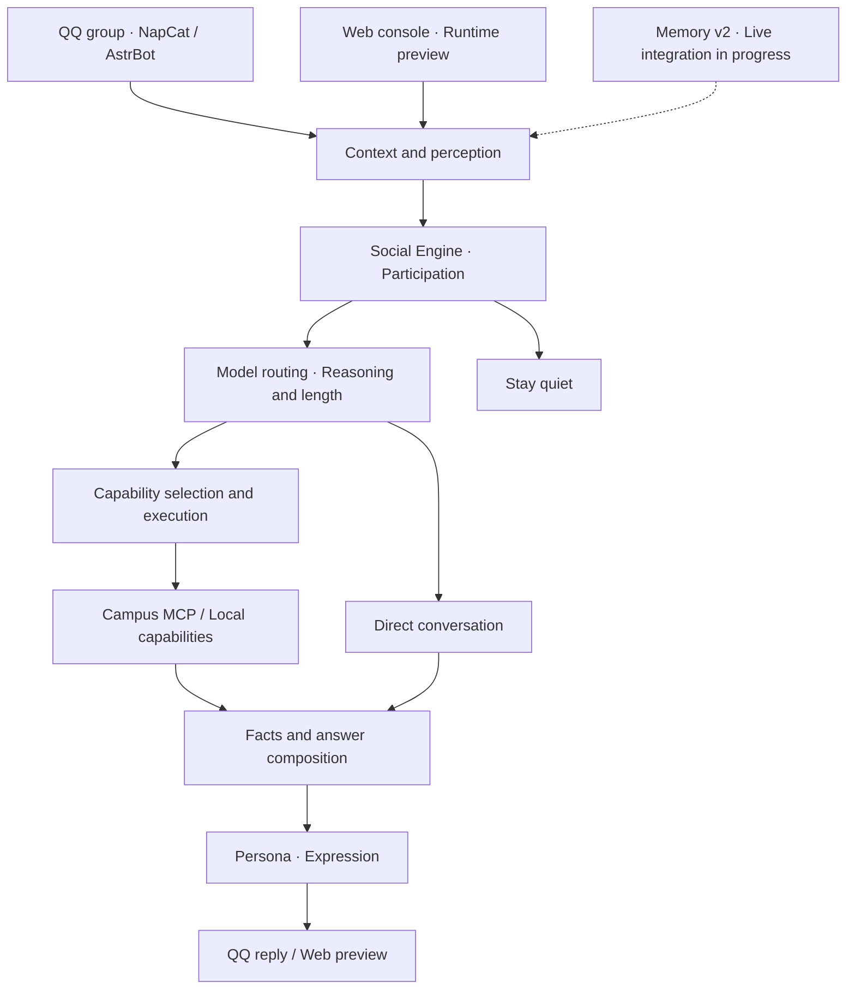

<div align="center">

# Dududa · 嘟嘟哒

**An AI friend living in your QQ group**

Better chat. More shared moments. An AI that belongs.

[简体中文](README.md) · [English](README.en.md)

[](LICENSE)
[](pyproject.toml)
[](apps/web/package.json)
[](https://github.com/ly382965/dududa/actions/workflows/ci.yml)

[Features](#features) · [Quick start](#quick-start) · [Architecture](#architecture) · [Roadmap](#roadmap) · [Contributing](#contributing)

<a href="docs/assets/dududa-poster.png">
  
</a>

</div>

## Meet your new groupmate

Dududa is an AI friend living in a QQ group. We want her to feel like the person who knows a little about everything: someone who can join a casual conversation, take a technical question seriously, help with everyday tasks, and know when to leave room for others.

The project explores **how AI can take part in a group's everyday life over time**. Context perception, a Social Engine, Memory, model routing, Skill/MCP capabilities, and personality work together toward that experience.

Life at the University of Science and Technology of China (USTC) is our starting point. You are welcome to bring Dududa to your own group, connect new services, and create different characters.

## Features

### Follow the conversation

- Read recent group context and handle references, replies, and corrections.
- Configure automatic participation per group, including probability, cooldown, frequency, and context size.
- Use natural language: an explicit mention starts a request, while enabled automatic participation can respond to ordinary group conversation.
- Choose model tier, reasoning effort, and response length independently.

### A friend who knows campus life

Dududa selects campus capabilities from natural-language requests, retrieves information, and organizes answers with sources.

| Capability | What it helps with |
| --- | --- |
| iCourse | Find courses, teachers, reviews, rankings, and statistics; distinguish similarly named courses and instructors. |
| USTC Young | Search extracurricular activities and view details, filtering by category, time, and count. |
| Academic information | Look up semesters, university-wide course offerings, exams, and teaching calendars. |
| Curriculum | Explore curriculum material by cohort and major, including course and program comparisons. |
| Campus notices | Search notices, details, calendars, and deadlines. |
| Campus shuttle | Query regular departures by campus, route, date, and time. |

Curriculum and shuttle results retain their source versions. USTC Young requires the operator's USTC CAS credentials.

### Personality and a playful side

Independent Persona assets describe voice, sentence length, and expression. Dududa can explain technical topics clearly and follow the tone of casual conversation. Emoji Kitchen provides emoji combinations, and interaction plugins can be configured per group.

We want her to gradually recognize people, remember shared experiences, and learn the group's jokes. Memory v2 already provides Chinese retrieval and lifecycle modules, alongside a structure for multiple Persona assets. Live long-term memory, character switching, and impressions of group members are the next steps.

### A workbench for your AI groupmate

The Vue/Node web console brings group conversations, Agent chat, run records, and settings together. Inspect the model, capability calls, and duration behind an answer; adjust services and participation per group; manage three model key pools; and inspect services in the MCP workbench.

The Web preview runs the same Runtime used by the QQ integration, making it useful for trying requests before enabling group delivery.

## Try asking

> 评课社区里《线性代数》的评价怎么样？
>
> What do iCourse reviews say about Linear Algebra?

> 查一下二课最近公开发布的学术活动，最多列 3 项。
>
> Find up to three recently published academic activities on USTC Young.

> 刚才说周五八点，后来改成周六八点了。最终什么时候开会？
>
> The meeting was moved from Friday at eight to Saturday at eight. When are we meeting?

The Chinese prompts match the project's current campus examples; the English lines explain their meaning. The console's run view shows the path taken for each request.

## Quick start

### Run locally

Install Python 3.12 and [uv](https://github.com/astral-sh/uv), then run:

```bash
git clone https://github.com/ly382965/dududa.git
cd dududa
uv sync --locked --python 3.12.13
uv run --locked python ops/cli/run_dududa_100_message_benchmark.py \
  --json-output /tmp/dududa-100-runtime.json \
  --report-output /tmp/dududa-100-runtime.md
```

The repository includes 100 fixed messages. This entry point runs the complete flow with scripted model responses and local campus data, producing answers, tool records, and a summary. It requires no model key or QQ login.

### Connect your QQ group

The full stack uses Linux, Docker Engine, and Docker Compose v2. Follow the [installation guide](docs/operations/submission-program.md) (Chinese) to:

1. Configure `.env`, runtime directories, and the campus credential file, then run `bash manage.sh up`.
2. Log into QQ through NapCat and run `bash manage.sh web-connect` to connect the workbench.
3. Configure model Providers and Dududa Core in AstrBot, then set the target group's services and participation in the Web console.

| Local interface | Address |
| --- | --- |
| Dududa Web console | <http://127.0.0.1:5173> |
| AstrBot | <http://127.0.0.1:6185> |
| NapCat | <http://127.0.0.1:6099> |

A fresh installation needs model endpoint and Runtime configuration. The [program guide](docs/operations/submission-program.md) includes those fields and automatic participation settings.

### Model configuration

The current demonstration uses DeepSeek through an OpenAI-compatible Chat Completions interface:

| Tier | Model | Reasoning effort | Role |
| --- | --- | --- | --- |
| Luna · Fast | `deepseek-v4-flash` | `low` | Perception and brief conversation |
| Terra · Standard | `deepseek-v4-flash` | `high` | Campus queries and general analysis |
| Sol · Deep | `deepseek-v4-pro` | `max` | More involved reasoning and comparison |

The base URL is `https://api.deepseek.com`. Calls go through AstrBot's `text_chat` interface, with credentials supplied by the deployment. Luna/Terra/Sol are application tier names; visible answer length is configured separately. See the [design document](docs/design/dududa-2.0-design-report.md) for request details.

## Architecture



The Python core connects to models, messaging platforms, and campus services through interfaces. Current campus queries use a single capability step. The planned Skill layer will compose these business operations into longer tasks and manage capability activation.

```text
packages/dududa-agent/   Perception, social decisions, memory, routing and responses
apps/astrbot-plugins/    QQ adapters, capabilities and interaction plugins
apps/web/               Vue 3 + Node.js console
services/mcp/           Campus services, MCP Console and isolated worker
configs/                Capabilities, mappings, Personas and configuration examples
deploy/                 Docker Compose and image builds
ops/                    Installation, runtime and verification tools
tests/                  Unit, contract and flow tests
docs/                   Design, guides and promotional artwork
```

## Development and verification

Python dependencies use `uv.lock`. Web development uses Node.js 22.18.0 and npm 10.9.3.

```bash
uv sync --locked --python 3.12.13
uv sync --project services/mcp/unified-worker --locked --python 3.12.13
uv run --locked python -m unittest \
  tests.test_dududa_100_message_benchmark \
  tests.contracts.test_production_composition \
  tests.contracts.test_proactive_talk
```

For Web development:

```bash
cd apps/web
npm ci
npm run dev
```

Run `npm test` and `npm run build` for relevant Web changes. See the [local development guide](docs/development/local-environment.md) and [CI workflow](.github/workflows/ci.yml) for other checks.

The submission validation on 2026-09-05 completed the 100-message offline flow, 81 focused tests, the Web build, and a core wheel installation check. Representative real DeepSeek results are documented in the [design report](docs/design/dududa-2.0-design-report.md).

## Roadmap

- [x] QQ integration and recent group context
- [x] Social Engine and configurable automatic participation
- [x] Six campus service areas and atomic capability calls
- [x] Independent Persona assets, emoji combinations, and group plugin settings
- [x] Model routing and a Web administration console
- [ ] More natural timing, topic tracking, and conversational rhythm
- [ ] Live long-term memory, impressions of group members, and shared experiences
- [ ] Multiple characters, speaking habits, and expression styles
- [ ] Skill orchestration, capability activation, and multi-step tasks
- [ ] Lower query latency, better group summaries, and proactive digests

## Documentation

| Topic | Entry point |
| --- | --- |
| Product and ideas | [Project introduction](docs/design/dududa-2.0-work-introduction.md) |
| Architecture and implementation | [Design document](docs/design/dududa-2.0-design-report.md) |
| Installation | [Program guide](docs/operations/submission-program.md) |
| Five-minute demonstration | [Video outline](docs/operations/demo-video-runtime-validation-2026-09-05.md) |
| New capabilities | [Adding a Capability](docs/development/adding-a-capability.md) · [Adding an MCP server](docs/development/adding-an-mcp-server.md) |
| Characters and memory | [Persona](docs/design/persona.md) · [Memory](docs/design/memory.md) |
| Original poster | [Dududa artwork](docs/assets/dududa-poster.png) |

Most detailed product documents are currently in Chinese.

## Contributing

Bring a piece of your group's everyday life: connect a service, add a useful scenario, improve an answer, design a character, or fix something that gets in the way.

- **Bugs and ideas:** open an [issue](https://github.com/ly382965/dududa/issues) with the scenario, reproduction steps, and expected behavior.
- **Code changes:** follow [Contributing](CONTRIBUTING.md), run relevant tests, and open a pull request.
- **New capabilities:** start with one useful operation, clear inputs and outputs, and a usage example.

Use synthetic or anonymized conversation examples, and keep credentials and QQ login data in your own runtime directories. Follow [Security](SECURITY.md) for vulnerability reports.

## Acknowledgements and license

Thanks to [AstrBot](https://github.com/AstrBotDevs/AstrBot), [NapCat](https://github.com/NapNeko/NapCat-Docker), [pyustc](https://github.com/USTC-XeF2/pyustc), and the campus data and open-source projects behind these capabilities.

Original Dududa code and documentation use the [MIT License](LICENSE). Third-party components retain their own licenses; see [Third-Party Notices](THIRD_PARTY_NOTICES.md).

---

Better chat, together. An AI friend that grows with your group.
