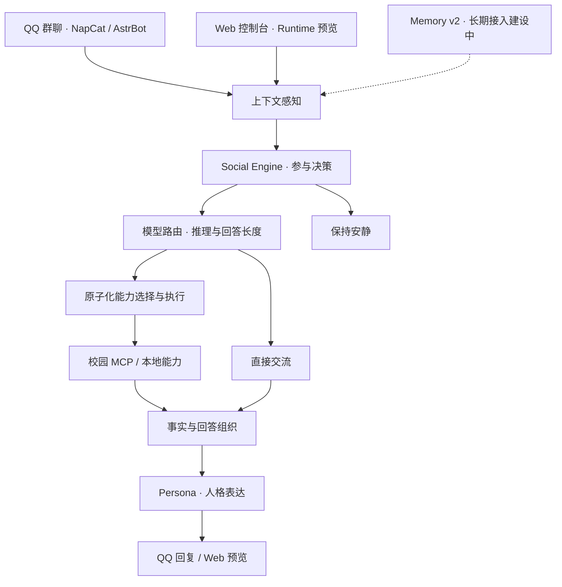

<div align="center">

# 嘟嘟哒 · Dududa

**生活在 QQ 群里的 AI 群友**

让 AI 成为群里的自己人。

[简体中文](README.md) · [English](README.en.md)

[](LICENSE)
[](pyproject.toml)
[](apps/web/package.json)
[](https://github.com/ly382965/dududa/actions/workflows/ci.yml)

[功能亮点](#功能亮点) · [快速开始](#快速开始) · [技术架构](#技术架构) · [开发路线](#开发路线) · [参与贡献](#参与贡献)

<a href="docs/assets/dududa-poster.png">
  
</a>

</div>

## 群里，来了一个 AI 群友

嘟嘟哒是一个生活在 QQ 群里的 AI 群友。我们希望她像群里一个什么都会一点的人：能接住闲聊，能认真讨论问题，知道什么时候出现，也懂得什么时候闭嘴。聊到选课、活动、考试和出行时，她又能找到相应资料，把事情说清楚。

这个项目探索的是 **AI 如何持续参与一个群体的日常生活**。上下文感知、Social Engine、Memory、模型路由、Skill/MCP 与人格表达，共同支撑从“这次回答得不错”到“这个群友越来越熟悉”的体验。

科大校园是嘟嘟哒开始生活的地方。也欢迎你把这套系统带到自己的群，接入新的服务，塑造不同的角色。

## 功能亮点

### 像群友一样接话

- **跟得上讨论**：读取近期群聊上下文，处理引用、指代和临时更正。
- **参与程度可调**：支持按群开启自动搭话，配置参与概率、冷却、频率和上下文窗口。
- **按话题启用能力**：管理员授予自适应权限后，她能从连续讨论中识别需求，开启原本关闭的查询插件，控制台同步显示启用原因。
- **任务直接说**：明确 @ 可以发起请求；开启自动参与后，普通群消息也能成为接话的起点。
- **回答长短合适**：模型档位、推理强度与回答长度独立配置，兼顾简短交流和展开讨论。

### 做最懂科大的 AI 群友

嘟嘟哒会根据自然语言问题选择对应的校园能力，查询资料并整理带来源的回答。

| 能力 | 可以帮你做什么 |
| --- | --- |
| 评课社区 | 找课程、教师与评论，区分同名课程和任课教师，查看评价与统计。 |
| 第二课堂 | 搜索活动、查看详情，按类别、时间和数量筛选。 |
| 教务信息 | 查询学期、全校开课、考试与教学日历。 |
| 培养方案 | 查询不同年级、专业的方案资料，比较课程与方案变化。 |
| 校园通知 | 搜索通知、查看详情、日历与截止日期。 |
| 校车出行 | 按校区、路线、日期和时间查询常规班次。 |

培养方案与校车结果保留资料版本。二课查询需要在部署端配置 USTC CAS 凭据。

### 有性格，也有玩心

人格通过独立的 Persona 资产描述：技术问题认真说清楚，日常聊天跟随群里的语气，表情和句长也有自己的节奏。Emoji Kitchen 提供表情合成，互动插件可以按群配置。

我们希望她逐渐认识群友、记住共同经历、学会群里的梗。当前已经实现 Memory v2 的中文检索和生命周期模块，准备了多 Persona 资产结构；长期记忆接入、多 OC 切换与群友印象正在这套基础上继续建设。

### 看得见，也调得动

Web 控制台把群聊、Agent 对话、运行记录和配置放在同一工作区。你可以查看一次回答所用的模型、能力和耗时，按群调整服务、插件与参与方式，管理三档模型 Key 池，并在 MCP 工作台检查服务连接。

Web 预览复用正式 Runtime，方便在接入 QQ 群聊之前调试问题和回答。

## 试着这样和她聊天

> 评课社区里《线性代数》的评价怎么样？

> 查一下二课最近公开发布的学术活动，最多列 3 项。

> 刚才说周五八点，后来改成周六八点了。最终什么时候开会？

> 给一个六人小组安排任务，每个人都要有明确产出。

这些问题分别连接到校园查询、上下文理解和直接交流。实际执行过程可以在控制台的“运行”页查看。

## 快速开始

### 先在本地跑起来

准备 Python 3.12 和 [uv](https://github.com/astral-sh/uv)，在终端执行：

```bash
git clone https://github.com/ly382965/dududa.git
cd dududa
uv sync --locked --python 3.12.13
uv run --locked python ops/cli/run_dududa_100_message_benchmark.py \
  --json-output /tmp/dududa-100-runtime.json \
  --report-output /tmp/dududa-100-runtime.md
```

项目自带 100 条固定消息，使用脚本模型和本地校园数据运行完整流程，生成逐题回答、工具调用与汇总报告。这个入口无需模型 Key 或 QQ 登录，适合先了解系统如何工作。

### 把她接到自己的 QQ 群

完整运行环境为 Linux、Docker Engine 和 Docker Compose v2。按 [安装与使用说明](docs/operations/submission-program.md) 完成：

1. 配置 `.env`、运行目录与校园认证文件，使用 `bash manage.sh up` 构建并启动服务。
2. 在 NapCat 扫码登录 QQ，运行 `bash manage.sh web-connect` 接入 Web 工作区。
3. 在 AstrBot 配置模型 Provider 和 Dududa Core，随后在 Web 中配置目标群的服务与参与方式。

| 本地入口 | 地址 |
| --- | --- |
| 嘟嘟哒 Web 控制台 | <http://127.0.0.1:5173> |
| AstrBot | <http://127.0.0.1:6185> |
| NapCat | <http://127.0.0.1:6099> |

首次安装需要完成模型端点与 Runtime 配置。完整步骤、模型字段和自动参与设置都在 [程序使用说明](docs/operations/submission-program.md) 中。

### 模型配置

当前演示使用 DeepSeek 的 OpenAI 兼容 Chat Completions 接口：

| 档位 | 模型 | 推理强度 | 用途 |
| --- | --- | --- | --- |
| Luna · 快速 | `deepseek-v4-flash` | `low` | 感知、简短交流 |
| Terra · 标准 | `deepseek-v4-flash` | `high` | 校园查询、一般分析 |
| Sol · 深度 | `deepseek-v4-pro` | `max` | 复杂论证与比较 |

录制环境保留快速档的轻量推理，标准档与深度档使用 `thinking: disabled` 直接组织查询结果；表中的推理参数是常规部署配置。

服务地址为 `https://api.deepseek.com`。模型通过 AstrBot `text_chat` 接口调用，Key 在部署端配置。Luna/Terra/Sol 是程序的档位别名，回答篇幅另外设置为短、中、长。详细调用方式见 [设计文档](docs/design/dududa-2.0-design-report.md)。

## 技术架构



| 模块 | 负责什么 |
| --- | --- |
| Context / Perception | 组织当前问题和近期讨论，识别意图、实体与引用。 |
| Social Engine | 决定如何参与，结合群策略调整接话节奏。 |
| Model Router | 选择模型配置，分别管理推理投入与可见篇幅。 |
| Capability / MCP | 将业务需求映射成独立查询，统一执行和结果结构。 |
| Persona | 组织稳定的中文表达风格与输出格式。 |
| Memory | 已实现中文 BM25、会话检索、写入和生命周期管理的离线模块。 |

核心使用 Python，通过接口接入模型、消息平台和校园服务。当前业务查询采用单步能力计划；已支持按群聊话题自适应启用获准的查询能力；后续 Skill 层将复用这些原子化能力，组织更长的任务。

```text
packages/dududa-agent/   智能体核心：感知、社交、记忆、路由与回答
apps/astrbot-plugins/    QQ 适配器、能力组件与互动插件
apps/web/               Vue 3 + Node.js 控制台
services/mcp/           校园服务、MCP Console 与独立 worker
configs/                能力定义、服务映射、人格与配置示例
deploy/                 Docker Compose 与镜像构建
ops/                   安装、运行与验证工具
tests/                 单元、接口与流程测试
docs/                  设计文档、使用说明与宣传素材
```

## 本地开发与验证

Python 依赖由 `uv.lock` 管理，Web 使用 Node.js 22.18.0 与 npm 10.9.3。

```bash
uv sync --locked --python 3.12.13
uv sync --project services/mcp/unified-worker --locked --python 3.12.13
uv run --locked python -m unittest \
  tests.test_dududa_100_message_benchmark \
  tests.contracts.test_production_composition \
  tests.contracts.test_proactive_talk
```

Web 开发：

```bash
cd apps/web
npm ci
npm run dev
```

提交相关 Web 改动前运行 `npm test` 与 `npm run build`。其他模块的验证入口见 [本地开发说明](docs/development/local-environment.md) 和 [CI 工作流](.github/workflows/ci.yml)。

本轮验证覆盖 100 题离线流程、26 项真实 MCP 查询、5 个真实模型问答，以及四人群聊的自适应启用流程。录制步骤与验证结果见 [录制操作单](docs/operations/recording-runbook.md)，技术验证见 [设计文档](docs/design/dududa-2.0-design-report.md)。

## 开发路线

- [x] QQ 群聊适配与近期上下文
- [x] Social Engine 与可按群配置的自动参与机制
- [x] 六类校园服务与原子化能力调用
- [x] 独立人格资产、表情合成与群插件配置
- [x] 多档模型路由与 Web 管理控制台
- [ ] 更自然的参与时机、话题跟随与群聊节奏
- [ ] 长期记忆接入、群友印象与共同经历
- [ ] 多 OC 切换、表达习惯与表情风格
- [ ] Skill 编排、能力自主启停与多步任务
- [ ] 更低的查询延迟、更准确的群摘要与主动日报

## 文档与作品材料

| 想了解什么 | 从这里开始 |
| --- | --- |
| 作品定位与创新点 | [作品简介](docs/design/dududa-2.0-work-introduction.md) |
| 完整架构与技术难点 | [设计文档](docs/design/dududa-2.0-design-report.md) |
| 安装与体验 | [程序使用说明](docs/operations/submission-program.md) |
| 五分钟演示 | [分镜与配音稿](docs/operations/demo-video-runtime-validation-2026-09-05.md) · [录制操作单](docs/operations/recording-runbook.md) |
| 扩展校园能力 | [新增 Capability](docs/development/adding-a-capability.md) · [新增 MCP Server](docs/development/adding-an-mcp-server.md) |
| 设计角色与记忆 | [Persona](docs/design/persona.md) · [Memory](docs/design/memory.md) |
| 海报原图 | [嘟嘟哒宣传海报](docs/assets/dududa-poster.png) |

## 参与贡献

欢迎带着你的群聊生活参与这个项目：接入一个校园服务，补充一条真实使用场景，改善一句回答，设计一个 OC，或者修复一个让人困扰的问题。

- **报告问题 / 提出想法**：在 [Issues](https://github.com/ly382965/dududa/issues) 描述使用场景、复现步骤和预期结果。
- **提交改动**：参考 [Contributing](CONTRIBUTING.md)，为行为变化运行相关测试，再提交 Pull Request。
- **扩展能力**：从一个可独立完成的任务开始，补齐输入、输出与使用示例。

请使用合成或脱敏的群聊样例，Key 和 QQ 登录数据留在自己的运行目录。安全问题通过 [安全报告说明](SECURITY.md) 联系维护者。

## 致谢与许可证

感谢 [AstrBot](https://github.com/AstrBotDevs/AstrBot)、[NapCat](https://github.com/NapNeko/NapCat-Docker)、[pyustc](https://github.com/USTC-XeF2/pyustc) 及相关校园数据与开源项目。

嘟嘟哒原创代码和文档采用 [MIT License](LICENSE)。第三方组件保留各自许可证，详见 [Third-Party Notices](THIRD_PARTY_NOTICES.md)。

---

一起聊天，一起变好。让 AI 成为群里的自己人。
