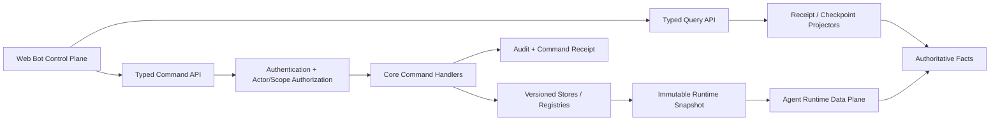
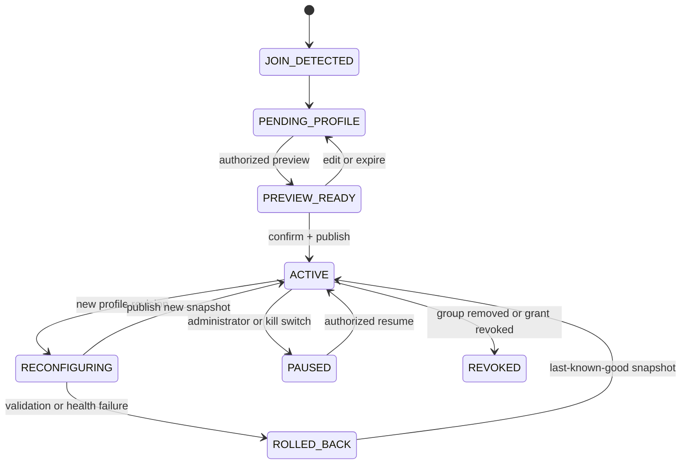

# Bot Control Plane 与群服务初始化设计

状态：设计方向已由用户确认；Tree revision 4 已将其映射为 S21A-S21C 与 S21 Audit，当前尚未
实现。S21 完成并通过离线审计前，暂停的 S23 真实群验证不得恢复。

## 1. 产品定位

Dududa 的长期形态是：

> **受治理的群体情境适应 Runtime**：一个不可卸载的最小治理内核，组合可逆、可观察、
> 分作用域的能力插件；系统把群聊理解为随时间变化且带不确定性的群体情境，在事实、权限、
> 人格和任务要求不变的前提下适应表达；所有自我改进先成为可评测、可撤销的候选资产，
> Bandit 只在安全等价的合法候选之间学习分配预算。

Web 不是只能观察的附属页面，而是 Dududa 的一等 **Bot Control Plane**。它负责让 Bot 管理员
看见当前事实、给出初始值、提交受治理命令、观察结果并执行回滚。其第一个核心用例是：

> Bot 进入一个群后，Bot 管理员在控制后台为该群选择初始服务。

“Control Plane”不表示浏览器拥有业务权威。Web UI、Control Plane API 和 Core Command
Handler 共同构成一个逻辑控制面；Identity、Scope、Authorization、Capability、Router、Memory、
Scheduler、Dispatch 和 Receipt 仍由治理内核拥有。禁止另写一套前端权限、路由或发送逻辑。

## 2. 核心术语

| 术语 | 含义 | 不是什么 |
| --- | --- | --- |
| Bot Control Plane | 管理员使用的查询、配置、审批、启停和回滚后台 | 浏览器本地状态或任意 OneBot 代理 |
| Group Onboarding | Bot/account/group 首次绑定后的初始化流程 | 收到第一条消息后自动猜配置 |
| Service Definition | 稳定业务 service ID、依赖、风险和 readiness 的声明 | Plugin ID、MCP Server ID 或 Tool 名 |
| Group Service Profile | 一个版本化、可回滚的群服务初值组合 | 权限凭据、模型 Prompt 或 MCP Tool 列表 |
| Group Service Assignment | 某个精确群 Scope 当前激活的 Profile 绑定 | 可由 Group Context 自动改写的偏好 |
| Desired Services | 管理员希望启用的服务集合 | 已经实际可执行的能力声明 |
| Effective Services | 经过实现、健康、授权和 rollout 过滤后的实际集合 | Profile 自行授予的权限 |
| Group Context | 带窗口、TTL 和不确定性的群级弱先验 | 服务开关、人物关系事实或权限 |

本文中的 Bot 管理员是经现有 `Actor` 和 `Authorization` 解析后具备群服务配置权限的操作者。
QQ 群主/管理员身份不能自动等价为 Bot 管理员；具体授权映射由部署策略决定。

现有 loopback QQ 工作台可以继续使用当前无浏览器登录的数据路径；Control Plane 的管理路由必须
单独建立 operator session。same-origin、loopback、QQ 群角色和 OneBot Access Token 都不能充当
管理员身份，OneBot Token 继续只存在于服务端。

## 3. 一个逻辑控制面



控制面分为两条路径：

- **Query Path**：从 Receipt、Checkpoint、Decision、Registry Health 和 Audit 派生只读投影；
- **Command Path**：把管理员意图封装为带 Actor、Scope、revision、幂等和审计的 Core 命令。

浏览器不直接写配置文件、SQLite 行、Registry、Memory 或 Scheduler，不直接指定物理模型 Endpoint，
也不把动态发现的 MCP Tool 变成 Capability。Web 后端是 Adapter，不是第二套 Domain。

## 4. Group Service Profile

管理员选择的是一个 **服务档案**，而不是一组随意开关。一个 Profile 至少包含：

控制台对管理员可以把一个 Profile 展示为一个“初始服务”，一次只选择一个；Profile 内部可以
组合多个稳定 business service ID。示例模板可以是 `observe-only`、`explicit-chat`、
`course-assistant` 或经审核的自定义组合，但它们不是固定枚举，也不代表当前已经可用。

| 字段组 | 内容 | 边界 |
| --- | --- | --- |
| Identity | `profile_id`、revision、digest、展示名 | ID 与展示文字分离 |
| Service Set | 稳定业务 service ID 集合 | 不使用原始 MCP Tool 名 |
| Persona | Persona/Profile 引用 | 不能改事实、安全或权限 |
| Inbound | trigger/social policy、上下文预算 | 初始值不能绕过显式 @ 等硬门禁 |
| Response | AnswerProfile policy 与输出预算引用 | 不绑定 Model Tier/Endpoint |
| Model | Role/Tier/Reasoning 的预算策略引用 | 不含 Provider Secret 或物理 model ID |
| Memory | `off/read/manual-write` 等受支持模式 | 自动写入不能由 Profile 开启 |
| Capability | 期望的业务 Capability 集合 | Profile 不授予 Capability |
| Proactive | digest/probe 的默认关闭策略引用 | 启用仍需独立订阅、Target/Grant 和发送授权 |
| Operations | quiet hours、频控、rollout、kill-switch policy 引用 | 行为级 switch 分离 |
| Compatibility | 所需插件/API/schema 版本 | 不满足时降级或拒绝激活 |

Profile 不保存真实群号、QQ 号、Token、Cookie、API Key、Provider Secret、原始 Prompt 或运行时
正文。真实目标只存在于受保护的 `GroupServiceAssignment` Scope 绑定中。

实际服务集合必须按以下顺序计算：

```text
Effective Services
  = Profile Requested Services
  ∩ Installed And Healthy Service Definitions
  ∩ Current Capability And Group-Policy Grants
  ∩ Rollout / Budget / Kill-Switch Eligibility
```

这延续 Dududa 的核心原则：**先过滤资格，再优化质量**。控制后台同时显示 Desired 与 Effective，
以及每个差异的稳定 reason code，不能把“配置里勾选了”显示成“已经可用”。

当前 iCourse 是唯一真实 MCP Server。评课只读服务可以作为未来首个真实 Service mapping；校园
资讯、arXiv、行业资讯、真实 Memory、主动 Probe/Digest 和在线 Bandit 在其 Adapter/授权门禁
关闭前必须显示为 `unavailable`、`shadow_only` 或 `authorization_required`，不能伪造可用状态。

## 5. 群入驻状态机



### 5.1 `JOIN_DETECTED`

Connector/NapCat 只报告 Bot/account/group 绑定事实，不自行选择服务。事件必须去重，且不能把群名、
第一条消息或模型输出解释为配置。

### 5.2 `PENDING_PROFILE`

这是缺省状态。Agent 不取得该群的回复或主动发送所有权，不启动 Memory 写入、Scheduler、Source
抓取或在线学习。控制后台把该群放入待初始化列表；不自动向群内发送欢迎或配置消息。

### 5.3 `PREVIEW_READY`

管理员选择 Profile 后，服务端解析当前 Catalog、Plugin generation、Capability grants、群策略、
rollout 和健康快照，返回 Desired/Effective diff、降级原因、预算影响和待确认变更。Preview 不发布
Runtime Snapshot，也不产生发送权。

### 5.4 `ACTIVE`

管理员确认后，Core 原子发布新的 `GroupServiceAssignment`，生成 Audit/Activation Receipt；Runtime
从不可变 snapshot 读取。激活中任一验证失败时保持 `PENDING_PROFILE` 或上一份 last-known-good，
不得部分开启服务。

## 6. Assignment 与命令边界

`GroupServiceAssignment` 至少绑定：

- 精确 platform、Bot/account、group Scope；
- Profile ID、revision、digest；
- Desired/Effective service IDs 与逐项 reason code；
- 选择者 Actor、授权/确认引用和策略 revision；
- assignment revision、状态、创建/激活时间；
- previous/LKG revision 与 Activation/Rollback Receipt。

首版命令面建议保持窄而完整：

| 命令 | 作用 | 必须验证 |
| --- | --- | --- |
| `group_service.preview` | 解析 Profile 和有效服务 | Actor/Scope、Catalog、grants、health、revision |
| `group_service.activate` | 首次原子激活 | preview digest、expected revision、确认、幂等、审计 |
| `group_service.update` | 创建并激活新 revision | 当前 assignment CAS、差异、迁移/回滚 |
| `group_service.pause` | 停止 Runtime 所有权 | 行为级停止结果和 Audit Receipt |
| `group_service.resume` | 恢复同一 revision | 当前授权、健康、kill switch 重验 |
| `group_service.rollback` | 恢复 LKG revision | rollback target、兼容性、幂等和 Receipt |

命令请求统一携带 authenticated Actor、exact Scope、command ID/idempotency key、expected revision、
canonical payload digest、deadline、reason 和 confirmation reference。HTTP 成功不等于领域成功；UI
只根据 Command Receipt 更新状态。

## 7. 初值与实时适应分权

| 层 | 示例 | 谁能改变 | 学习能否改变 |
| --- | --- | --- | --- |
| 治理硬边界 | Scope、权限、服务集合、Memory/主动发送模式、预算上限 | 管理员受治理命令 | 否 |
| 身份硬边界 | Persona identity、事实/拒绝/引用约束 | 版本化资产发布 | 否 |
| 群服务初值 | trigger/response 默认、可用 Capability、quiet hours | 管理员 Profile revision | 否 |
| 群体情境 | 主题分布、互动节奏、形式分布、TTL | 授权数据投影 | 只能产生弱先验 |
| 表达候选 | StyleEnvelope、Prompt/Skill candidate | Eval + 人工发布 | 只能生成候选 |
| 资源分配 | 同 Role/Tier 合法 Endpoint 排序 | 静态 Router 后的 Bandit | 仅安全等价集合 |

当前消息的明确要求、事实义务、Persona 和服务档案始终高于群体情境。群里逐渐形成的语言习惯
不能让 Bot 自动开启新工具、把短回答改成长回答、主动私聊、添加推送或提高成本上限。

## 8. 控制后台信息架构

### 8.1 入驻收件箱

- 新检测到但未初始化的群；
- Bot/account、群 Scope 的受控引用和发现时间；
- 可选 Profile Catalog、兼容性和当前健康；
- Preview、确认和过期状态。

### 8.2 群服务页

- 当前 Profile/Assignment revision 和 LKG；
- Desired/Effective 服务及差异原因；
- Persona、触发/回答、Memory、Capability、主动行为和预算摘要；
- 更新、暂停、恢复和回滚命令；
- Group Context 只读弱先验及更新时间，不展示个人风格指纹。

### 8.3 全局运维页

- Runs、Router/Model、Capability/MCP、Memory、Source/Scheduler、Plugin、Bandit/Eval；
- rollout、digest、probe 等行为级 switch、owner 和 revision；
- Command/Audit/Delivery Receipt、UNKNOWN 和回滚状态；
- `fixture/offline/shadow/canary/live` 证据模式和 provenance。

## 9. QQ 操作与 Agent 操作必须分开

现有 Mew/NapCat 工作台允许真人操作者通过 typed gateway 发送普通 QQ 消息，这是 QQ 客户端能力。
Agent 生成的 Reply Draft、主动消息和自动回复则必须经过 Agent Preview/Dispatch/Output 权威链。

当前 `approveDraft()` 直接调用 NapCat、`respondPermission()` 和 `saveSettings()` 只改浏览器状态；
因为 Agent 后端为空，这些路径当前不可达。接通 Control Plane 前必须替换为 governed command，
并以 `DeliveryReceipt` 或 Command Receipt 为结果，不能复用真人 QQ 发送路径绕过 Runtime。

## 10. 故障与恢复

- 未识别 Bot 管理员、缺 Scope、过期 preview、revision 冲突：拒绝，不改变 assignment；
- Profile 引用未知服务或真实 Adapter 不存在：显示不可用；严格 Profile 可整体拒绝，宽松 Profile
  只能明确降级；
- Catalog/Plugin generation 在 Preview 后变化：激活前重新解析并要求新 Preview；
- Audit、Authorization、Limiter、Store 或 Projector 不可用：mutation fail closed；
- 发布 snapshot 后健康失败：保留失败 Receipt，单次回滚到 LKG，不循环切换；
- Bot 退群、授权撤销或群 Scope 改变：assignment 进入 `REVOKED`，未发送工作全部失效；
- Control Plane 暂时不可用：已激活 Runtime 使用冻结 snapshot，不能猜测新配置。

## 11. S21 执行顺序

Tree revision 4 已将 S21 设为 S23 的前置，按以下顺序执行：

1. **S21A Control Plane Foundation**：冻结 Profile/Assignment/Command/Query DTO，建立 operator
   authentication/RBAC、Projector、Command Gateway、Audit 和 Fake Group Join；
2. **S21B Group Onboarding**：实现 pending inbox、Profile Catalog、Preview/Activate/Pause/Rollback、
   Desired/Effective diff 和 immutable Runtime snapshot；
3. **S21C Governed Operations**：接入 Run/Model/MCP/Plugin/Memory/Proactive 查询，以及已有专用
   Core 命令支持的审批、订阅和行为级开关；
4. **S21 Completion Audit**：跨账号/群 Scope、并发 CAS、重启/LKG、权限、审计、浏览器直写和
   direct-NapCat Agent send 的负向审计。

S21 使用 Fake join、Fake services 和固定 Catalog 即可离线闭环，不需要 100 群聊天记录。只有
真实 Bot/group 身份绑定、真实 Provider/Source/Output Conformance 和真实发送留给 S23。

## 12. 完成定义

S21 只有同时满足以下条件才可称为完成：

- 新群缺 Profile 时零 Agent 回复、零 Tool/Memory/Source/Scheduler/发送；
- 只有经授权管理员能 Preview/Activate/Update/Pause/Rollback；
- Profile 不能自授予 Capability，未知/不健康/未授权服务不会进入 Effective；
- 两个管理员并发激活只有一个 revision 成功，重复请求只产生一个业务结果；
- Runtime 只读取原子不可变 Assignment snapshot，失败恢复 LKG；
- Group Context、插件、模型和 Bandit 均不能改变服务或发送权限；
- 所有 mutation 具有 Actor/Scope、CAS、幂等、Audit 和 Receipt；
- 多 Bot、账号和群的 Assignment、查询、命令和浏览器缓存无串联；
- Agent Draft 不直发 NapCat，浏览器本地开关不再伪装为有效配置；
- iCourse 之外没有任何虚构的真实 MCP/Source 服务状态。

达到这些条件只能声明“控制后台与群服务初始化离线完成”，不能声明真实群体验、真实 Provider、
真实 Source、在线学习或 S23 已完成。
