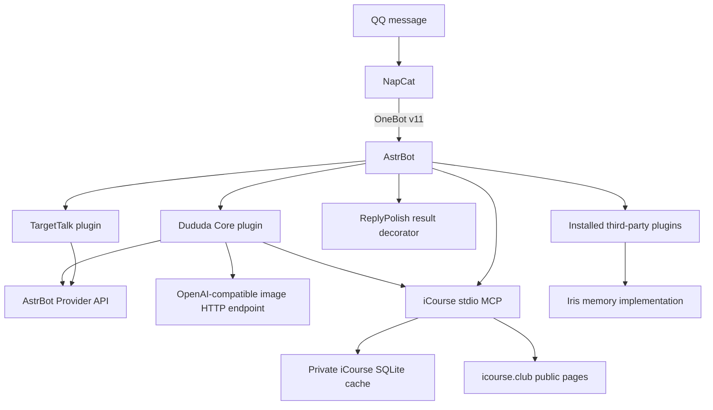

# Dududa Dependency Map

Status: Phase 0 current-state dependency audit
Baseline: `2767cc9768d4bce63d4b4ee811add951ebce6870`

## Runtime Dependency Graph



Important facts:

- Core and AstrBot each have a path to iCourse, so MCP ownership is duplicated.
- Core and TargetTalk use AstrBot Providers, while image generation uses direct
  HTTP and reads Provider source configuration itself.
- The three first-party plugins do not import one another. Their ordering and
  side effects are controlled by AstrBot.
- Core does not call Iris; Iris is a parallel third-party plugin.

## Deployment Dependency Graph

```text
.env or .env.example
        |
        v
manage.sh ------------------------------------------------------+
  |          |               |                |                 |
  v          v               v                v                 v
sync      plugin          Docker           Compose          Persona
script    installer       build            runtime          seed
  |          |               |                |                 |
  v          v               v                v                 v
MCP      manifest +       AstrBot +       AstrBot and       AstrBot DB +
template vendor + patch   iCourse wheel   NapCat volumes    cmd_config.json
```

### `up` dependencies

| Step | Reads | Writes or invokes |
| --- | --- | --- |
| Environment selection | `.env`, falling back to `.env.example` | Shell variables |
| `init` | safe MCP template | `.env`, runtime directories, runtime MCP JSON |
| `plugins` | `plugins.lock.json`, `vendor/`, `patches/`, public Git repositories | Runtime plugin directories and lock markers |
| Network preparation | `EDGE_NETWORK` | External Docker network if missing |
| Build/start | Compose, Dockerfile, iCourse source, image digests | Derived image and two containers |
| `seed` | Persona metadata and prompt | AstrBot Persona table and default-Persona setting |
| Restart | Compose project | AstrBot process reload |

### Hard-coded path consumers

| Path contract | Consumers |
| --- | --- |
| `compose.yml` at repository root | `manage.sh`, README, CI, user workflows |
| `docker/astrbot/Dockerfile` | Compose build definition |
| `services/icourse-mcp` | Dockerfile, Compose mount, CI cache/install, docs |
| `plugins/<plugin-id>` | Compose read-only mounts, metadata links, tests |
| `config/personas` | Compose mount, seed command, tests, CODEOWNERS |
| `config/astrbot/mcp_server.json` | sync script and tests |
| `plugins.lock.json` | installer, tests, CODEOWNERS, contributor policy |
| `patches/` and `vendor/` | installer, tests, licensing rules |

Moving any one of these paths without updating every consumer in the same
reviewable change will break a clean-clone bootstrap.

## Python Module Dependencies

### Dududa Core

```text
main.py
  -> AstrBot public API and one internal GreedyStr type
  -> httpx
  -> audit.py
       -> AstrBot Event
       -> config.py
  -> permissions.py
       -> AstrBot Event
       -> config.py -> AstrBot cmd_config.json
  -> course.py
       -> MCP Python client
       -> config.py -> paths
  -> help_menu.py
  -> config.py -> filesystem and JSON
```

Policy and persistence code therefore depend upward on AstrBot types. This is
the opposite of the intended adapter-to-core dependency direction.

### Target Talk（Dududa 1.0 历史审计基线）

```text
target_talk/main.py
  -> AstrBot Context and Provider APIs
  -> AstrBot internal AIOCQHTTP event class
  -> process-local history and cooldown dictionaries
```

The direct internal import created an AstrBot upgrade risk. The plugin source is
retained as migration material, but Target Talk no longer belongs to the Dududa
2.0 default Compose or inbound path; governed Probe/Proactive Runtime owns the
future behavior.

### Reply Polish

```text
reply_polish/main.py
  -> AstrBot result-decoration hook
  -> AstrBot QQ message components
  -> embedded pure text-splitting functions
```

The splitting algorithm is extractable, but its current entry point is a global
AstrBot result hook.

### iCourse MCP

```text
server.py -> FastMCP -> crawler.py -> fetcher.py -> httpx
                         |             parser.py -> BeautifulSoup
                         |             storage.py -> sqlite3
                         `-----------> models.py

cli.py -> crawler.py and storage.py
run_icourse_mcp.py -> server.py
```

The service is already substantially separated from AstrBot. Its main coupling
is deployment location and the current Core-specific client. It is the best
candidate for the first standard Capability Provider and MCP contract.

## Current Data Flows

### Message and response

```text
AstrBot Event
  -> Core command/event handler
  -> optional Provider or MCP calls
  -> AstrBot result
  -> ReplyPolish global result decorator
  -> QQ components
```

TargetTalk is a side path: it consumes a group event and calls `event.send()`
directly. It does not pass through a shared Runtime response model.

### Course request

```text
AstrBot Event
  -> regex or Provider-based keyword extraction
  -> repeated ICourseClient.call()
  -> new stdio server for each call
  -> crawl/cache/query
  -> optional Provider summary
  -> fixed string/card formatting
  -> AstrBot plain result
```

There is no plan object, observation list, validator, maximum tool-step count,
or shared call trace.

### Lightweight memory

```text
AstrBot Event -> sender/group IDs -> JSON CRUD
```

No retrieval path feeds this state to Context Builder or a model. Iris has its
own separate event hooks and storage.

### Configuration

```text
AstrBot plugin schema -> runtime plugin JSON
AstrBot cmd_config.json -> Provider/admin/default-Persona data
repository Persona files -> seed script -> AstrBot SQLite and JSON
repository MCP template -> sync script -> runtime MCP JSON
```

Core reads and writes AstrBot-owned JSON directly. Invalid JSON is sometimes
treated as empty state, which makes corruption hard to distinguish from an
unconfigured runtime.

## External Dependencies

| Dependency | Type | Current contract | Ownership |
| --- | --- | --- | --- |
| AstrBot | Pinned container base | Plugin loading, Event, Provider, Persona DB schema | External framework |
| NapCat | Pinned container | QQ login and OneBot v11 | External adapter |
| OpenAI-compatible Provider | Runtime-private config | Text and image APIs | External service |
| `icourse.club` | Public website | HTML and public search endpoints | External data source |
| MCP Python SDK | `>=1.2.0` | stdio client/server | Python dependency |
| Six third-party plugins | Git/vendor manifest | AstrBot plugin APIs | External code |
| `mmdustc-edge` | External Docker network | Stable service aliases | External deployment integration |
| Host filesystem | Runtime data root | Databases, memory, config, login state | Operator-owned private state |

## Third-Party Installation Dependencies

`scripts/install_plugins.py` interprets one JSON list but supports different
physical modes:

```text
manifest item
  |-- source=git -> clone -> optional sparse checkout -> exact commit
  |                                      `-> optional git apply patch
  `-- source=vendor -> copy repository vendor directory
```

It validates full Git commit syntax and patch applicability. It does not yet
validate content integrity, a uniform install mode, all license fields, or the
manifest against a formal schema. Git and sparse items also omit an integrity
digest independent of the upstream repository.

## Boundary Violations To Remove Gradually

| Current dependency | Why it is a problem | Migration boundary |
| --- | --- | --- |
| `PermissionManager -> AstrMessageEvent` | Security policy cannot run without AstrBot | Event adapter creates a domain `Actor` |
| `AuditLog -> AstrMessageEvent` | Audit schema and sink are framework-coupled | Adapter builds an `AuditEvent` |
| Core -> concrete iCourse stdio command | Agent logic owns process details | Unified MCP Client and Capability Provider |
| Core -> AstrBot Provider and raw HTTP Provider | Role routing is scattered | `ModelGateway` plus role-based Model Router |
| Core -> JSON paths derived from plugin location | Domain behavior owns storage layout | Repository interfaces and runtime adapters |
| TargetTalk -> internal AIOCQHTTP class | Framework-internal version coupling | Message Envelope adapter |
| ReplyPolish -> all AstrBot results | Formatting affects unrelated plugins | Explicit Output Adapter with compatibility mode |
| NapCat -> full AstrBot data mount | Excessive access to secrets and memory | Minimum-volume contract after validation |
| MCP export -> arbitrary path | Tool can overwrite process-visible files | Scoped export repository and permission check |

## Required Future Dependency Direction

```text
AstrBot / QQ adapters
        |
        v
Application Runtime and use cases
        |
        v
Domain models and core Protocols
        ^
        |
Infrastructure implementations injected at the composition root
```

The arrow into Infrastructure is inversion through Protocols: Agent Core owns
interfaces, while AstrBot, Iris, MCP, filesystem, and Provider implementations
depend on those interfaces. Domain and Runtime modules must not import AstrBot,
NapCat, OneBot, Docker, a concrete MCP server, or a Provider SDK.

## Migration Dependency Order

1. Freeze observable AstrBot and operation contracts with tests.
2. Add an installable core package containing pure domain models and Protocols.
3. Extract security, redaction, and typed configuration behind compatibility
   modules.
4. Split command and event adapters while preserving plugin IDs and mount paths.
5. Add fail-closed memory scope and an Iris adapter.
6. Introduce Runtime State, Context Builder, Perception, Social Decision, and
   Response Composer.
7. Unify Capability and MCP access, using iCourse as the reference provider.
8. Move deployment, operations, and third-party paths with compatibility
   wrappers and same-PR consumer updates.
9. Add eval, tracing, behavior isolation, build, and smoke gates.
10. Remove compatibility code only after no import or runtime path uses it.
