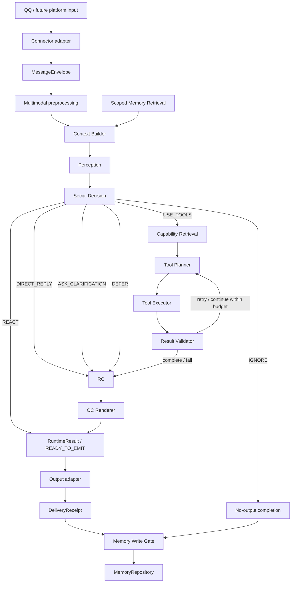

# Dududa 2.0 Target Architecture

Status: Phase 1 design; not yet implemented
Baseline: `2767cc9768d4bce63d4b4ee811add951ebce6870`

## Objectives

Dududa remains one Bot Runtime Monorepo. The refactor separates stable Agent
contracts from AstrBot, QQ, MCP transport, Provider, filesystem, and deployment
details without splitting the runtime into repositories that cannot be tested
or released together.

The architecture must make these statements true:

1. Every platform input becomes a framework-neutral `MessageEnvelope`.
2. One explicit `RuntimeState` travels through a bounded orchestration pipeline.
3. Social Decision chooses an action before Persona rendering or tool calls.
4. Memory retrieval is fail-closed by exact Scope before semantic ranking.
5. Tool planning sees a retrieved Top-K capability set, not every raw tool.
6. All MCP servers are reached through one Client and Server Registry.
7. Model Router chooses by role; Tool Router chooses capabilities.
8. Response Composer protects facts and errors; OC Renderer changes expression
   only.
9. AstrBot plugins become thin, separately loadable compatibility adapters.
10. Deployment remains reproducible, reviewable, and rollback-capable.

## End-To-End Flow



Every transition appends a redacted trace event. A transition cannot be hidden
inside one prompt. Models may produce structured proposals, but deterministic
code validates states, permissions, scopes, call budgets, and tool results.

## Layering And Dependency Direction

```text
apps/* adapters and composition roots
        |
        v
packages/dududa-agent application Runtime and use cases
        |
        v
packages/dududa-agent domain models and owned Protocols
        ^
        |
infrastructure implementations injected by a composition root
```

Domain and Runtime must not import:

- AstrBot Event, Context, Provider, or message-component types.
- NapCat, OneBot, Docker, Compose, or host paths.
- `icourse_mcp` or any concrete MCP server package.
- a concrete model Provider SDK.
- Iris classes or storage layout.

Concrete implementations may import core Protocols. The application composition
root is allowed to import both interfaces and implementations to wire them.

An automated import-boundary test will reject inward layers importing forbidden
modules or outward adapter paths.

## Target Repository Layout

This is an end state, not a one-PR move. The exhaustive path authority is
`../design/repository-layout.md`; this view emphasizes ownership boundaries:

```text
dududa/
├── apps/
│   └── astrbot-plugins/
│       ├── astrbot_plugin_dududa_core/
│       │   ├── main.py
│       │   ├── adapters/
│       │   ├── commands/
│       │   └── compatibility/
│       ├── astrbot_plugin_reply_polish/
│       └── astrbot_plugin_target_talk/
├── packages/
│   └── dududa-agent/
│       ├── pyproject.toml
│       └── src/dududa/
│           ├── domain/
│           ├── runtime/
│           ├── memory/
│           ├── capabilities/
│           ├── models/
│           ├── persona/
│           ├── security/
│           ├── config/
│           └── infrastructure/
├── services/
│   └── mcp/
│       ├── icourse/
│       └── README.md
├── configs/
│   ├── personas/
│   ├── models/
│   ├── capabilities/
│   ├── policies/
│   └── mcp/
├── deploy/
│   ├── compose/compose.yml
│   ├── docker/astrbot/Dockerfile
│   └── env/.env.example
├── ops/
│   ├── cli/
│   ├── migrations/
│   └── manage.sh
├── third_party/
│   ├── manifest.json
│   ├── patches/
│   └── vendor/
├── tests/
│   ├── unit/
│   ├── contracts/
│   ├── integration/
│   ├── evals/
│   ├── fixtures/
│   └── smoke/
├── docs/
│   ├── design/
│   ├── operations/
│   ├── development/
│   ├── adr/
│   └── refactor/
├── manage.sh              # compatibility wrapper during migration
├── compose.yml            # compatibility entry until portability is proven
├── .env.example           # compatibility template during migration
└── root policy documents
```

### Intentional deviations from the proposed single-plugin layout

The target keeps three AstrBot plugin roots rather than one
`apps/astrbot-plugin/astrbot_plugin_dududa` directory. Current plugin IDs,
configuration filenames, data directories, event hooks, and global result
decoration are independent runtime contracts. Merging them would create a
behavioral migration and a data migration at the same time.

The final host source locations may move, but Compose must continue mounting
them to:

```text
/AstrBot/data/plugins/astrbot_plugin_dududa_core
/AstrBot/data/plugins/astrbot_plugin_reply_polish
/AstrBot/data/plugins/astrbot_plugin_target_talk
```

The distribution `dududa-agent` will expose the Python import package `dududa`.
It must be installed into the derived AstrBot image before any compatibility
plugin imports it. Accidental repository-root `PYTHONPATH` access is forbidden.

## Core Data Contracts

### Message Envelope

```text
MessageEnvelope
  schema_version: int
  message_id: str
  platform: str
  bot_id: str
  conversation_type: ConversationType
  conversation_id: str
  group_id: str | None
  user_id: str
  reply_to: MessageReference | None
  timestamp: timezone-aware datetime
  text: str
  attachments: tuple[AttachmentRef, ...]
  mentions: tuple[Mention, ...]
  metadata: immutable mapping[str, JsonValue]
```

Construction validates required identities and conversation consistency. A
group message without `group_id`, an empty Bot identity, or a naive timestamp is
invalid. Adapter-only raw objects may be retained in an out-of-band handle but
must never enter serializable domain metadata.

### Identity And Conversation Scope

```text
Actor
  platform: str
  bot_id: str
  user_id: str
  roles: frozenset[RoleId]
  deny_flags: frozenset[DenyFlag]

ConversationScope
  platform: str
  bot_id: str
  conversation_type: ConversationType
  conversation_id: str
  group_id: str | None
  persona_id: str
```

The adapter resolves Actor roles and deny overlays from trusted configuration.
Runtime validates that Actor platform, Bot, and user identities match the
Envelope. User identity is deliberately absent from `ConversationScope`; it
remains in Envelope/Actor and is added to `MemoryScope` only when required by
the memory type. Permission policy receives these domain values, not an AstrBot
Event.

### Response And Runtime Result

```text
FinalResponse
  response_id: str
  blocks: tuple[RenderedBlock, ...]
  citations: tuple[Citation, ...]
  target_users: tuple[ResolvedIdentityRef, ...]
  attachments: tuple[GeneratedAssetRef, ...]
  render_metadata: RenderMetadata
```

Response Composer creates a fact-stable `DraftResponse`; Persona Renderer turns
it into `FinalResponse`. `RuntimeResult` wraps the execution outcome, optional
`FinalResponse`, optional reaction, reason codes, trace summary, and whether a
delivery acknowledgement is required. Reactions therefore belong to
`RuntimeResult`, not `FinalResponse`. AstrBot `Plain`, `Image`, `Node`, and
`Nodes` are output-adapter types, never domain types.

## Runtime State And Orchestration

One execution owns an immutable-or-copy-on-transition state containing:

```text
message
actor
conversation_scope
context
perception
social_decision
candidate_capabilities
tool_plan
tool_observations
draft_response
final_response
memory_candidates
trace
budget
```

The state machine stages are:

```text
RECEIVED -> PREPROCESSED -> CONTEXT_READY -> PERCEIVED -> DECIDED
  -> [TOOLS_PLANNED -> TOOLS_EXECUTED -> VALIDATED]*
  -> COMPOSED -> RENDERED -> READY_TO_EMIT
  -> [Output Adapter] -> DELIVERY_ACKNOWLEDGED
  -> MEMORY_EVALUATED -> COMPLETED
```

`FAILED` and `DEFERRED` are explicit outcomes. They are terminal phases only
when no safe visible output remains; when a safe boundary/error response exists,
the state follows the normal `READY_TO_EMIT` and acknowledgement path. Invalid
transitions raise a typed programming error. Tool loops are bounded by
configured steps, elapsed time, cost, and repeated-call detection. The Output
Adapter is outside core:
`run()` returns at `READY_TO_EMIT`, then a platform-neutral `DeliveryReceipt`
drives an idempotent acknowledgement call. No-output outcomes pass through the
Write Gate without inventing a delivery. Automatic memories that claim a reply
was delivered are committed only after a successful receipt.

## Perception And Social Decision

Perception produces validated structured data:

```text
should_consider_response, target_users, speech_acts, topics, entities,
references, resolved_references, possible_intents, need_tools, confidence,
ambiguities
```

Social Decision emits exactly one of:

```text
IGNORE, REACT, DIRECT_REPLY, USE_TOOLS, ASK_CLARIFICATION, DEFER
```

Deterministic guards run before and after any model proposal: mute and permission
policy, direct mention, cooldown, rate limit, conversation mode, confidence,
reply value, interruption risk, and tool allowance. Persona does not choose the
action.

TargetTalk initially remains a compatibility adapter. Its deterministic
target/keyword/probability behavior can be extracted and tested before it is
translated to Social Decision inputs.

## Memory Boundary

`MemoryScope` contains:

```text
platform, bot_id, conversation_type, conversation_id, group_id, user_id,
persona_id, memory_type
```

Exact scope filtering is mandatory before semantic retrieval. Missing required
scope metadata fails closed; a model cannot repair or approve an ambiguous
match.

Memory categories are Session State, Short-term Conversation, User Profile,
Group Memory, Episodic Memory, and Explicit User Memory. `MemoryRepository` is
owned by core. Iris is one adapter and its existing patch is defense in depth,
not the primary scope guarantee.

The Write Gate evaluates source identity, sensitivity, future value,
duplication, conflicts, target Scope, TTL, and whether confirmation is required.
Response rendering cannot write memory directly.

## Capability And Tool Runtime

A normalized capability includes ID, description, category, provider, versioned
input/output schemas, risk and privacy levels, allowed contexts, permissions,
cost/latency hints, idempotence, and tags.

Capability Retrieval performs deterministic eligibility filtering and semantic
ranking, exposing only Top-K candidates to the planner. The loop is:

```text
retrieve -> plan -> permission/argument validation -> execute -> observe
         -> result validation -> continue, retry, clarify, or finish
```

Retries are allowed only for classified transient errors and safe calls. The
executor enforces per-capability timeout, call count, total steps, audit, and
redaction.

All MCP process details live behind `UnifiedMcpClient` and `McpServerRegistry`.
iCourse becomes the reference provider. Agent Runtime depends on capability
contracts, not `icourse_mcp` modules or stdio commands.

## Model Routing

Model roles are separate from capabilities:

```text
PERCEPTION
SOCIAL_DECISION
TOOL_PLANNING
DIRECT_CHAT
RESPONSE_COMPOSITION
MEMORY_SUMMARY
IMAGE_UNDERSTANDING
IMAGE_GENERATION
```

`ModelRouter` resolves an externalized role policy to a `ModelGateway`. It
applies timeout, structured-output validation, fallback, cost limits, and trace
metadata without exposing credentials. Model IDs and Provider sources do not
belong in command code.

## Response Composer And OC Renderer

Response Composer merges direct answers and validated observations, preserves
facts, labels uncertainty, maps errors, selects citations, controls length, and
applies safety policy.

OC Renderer receives already-approved content and may change tone, phrasing,
address terms, and light expression. It may not alter numbers, citations,
permissions, tool status, safety decisions, or error semantics. A post-render
fact guard compares protected spans or structured response parts.

ReplyPolish's pure splitting function becomes Output Adapter formatting. Its
global AstrBot hook remains in compatibility mode until every affected output
contract is tested.

## Security, Privacy, And Audit

- Permission is evaluated from domain Actor, Scope, action, and resource.
- All memory and capability access is fail-closed on missing identity/scope.
- Redaction handles both sensitive field names and credential value patterns.
- Audit records stable event IDs and hashed/pseudonymous principals where full
  IDs are unnecessary.
- Raw messages, model prompts, and tool arguments are not traced by default.
- Rate limits apply by platform, Bot, conversation, user, capability, and model
  role as appropriate.
- External content is always data, never instructions.
- File capabilities use approved repositories or roots, not arbitrary paths.

## Error And Recovery Model

Errors are normalized into categories: validation, permission, privacy,
configuration, unavailable dependency, timeout, transient external, permanent
external, unsafe request, budget exhausted, and internal.

Each category defines retry eligibility, public wording, audit severity, and
whether a fallback is allowed. Raw exception strings, credentials, paths, and
external response bodies are not returned to users.

## Tracing And Evaluation

A trace contains redacted stage transitions, durations, selected model role,
candidate capability IDs, tool call status, retry reason, memory counts by type,
decision reason codes, and final outcome. It excludes raw secrets and defaults
to excluding message content.

Evaluation fixtures cover reply decisions, targets, intent, references, tool
selection, arguments, memory isolation, result validation, and OC consistency.
Unit, contract, integration, eval, and smoke layers have distinct ownership.

## Coexistence And Cutover

Migration has four states:

1. **Additive:** pure package and tests exist; no event uses it.
2. **Shadow:** adapters build envelopes and optionally run redacted comparison
   traces; legacy output remains authoritative.
3. **Selective cutover:** one command or event path calls the new use case,
   guarded by configuration and rollback.
4. **Cleanup:** legacy code is removed only after production entry, tests, docs,
   no old imports, no old path users, and rollback evidence are all present.

Compatibility code must live under a visibly named `compatibility` or `legacy`
module and state its removal gate. It must not become an untracked permanent
layer.

## Current Implementation Status

| Target area | Current status |
| --- | --- |
| Message Envelope and Runtime State | Not implemented |
| Context Builder and Perception interface | Not implemented |
| Explicit SocialAction | Not implemented; TargetTalk is partial legacy behavior |
| Scoped MemoryRepository and Write Gate | Not implemented; Iris is independent |
| Capability Registry and Retrieval | Not implemented |
| Unified MCP Client and Registry | Not implemented; two iCourse paths exist |
| Tool Planner/Executor/Validator loop | Not implemented |
| Role-based Model Router | Not implemented; three concrete paths exist |
| Response Composer / OC Renderer split | Not implemented |
| Domain permission and audit contracts | Not implemented; framework-coupled code exists |
| Operation stages and rollback | Partially implemented by `manage.sh` |
| Core package | Not implemented |

Detailed migration steps and removal gates are in `migration-map.md` and
`implementation-plan.md`.
